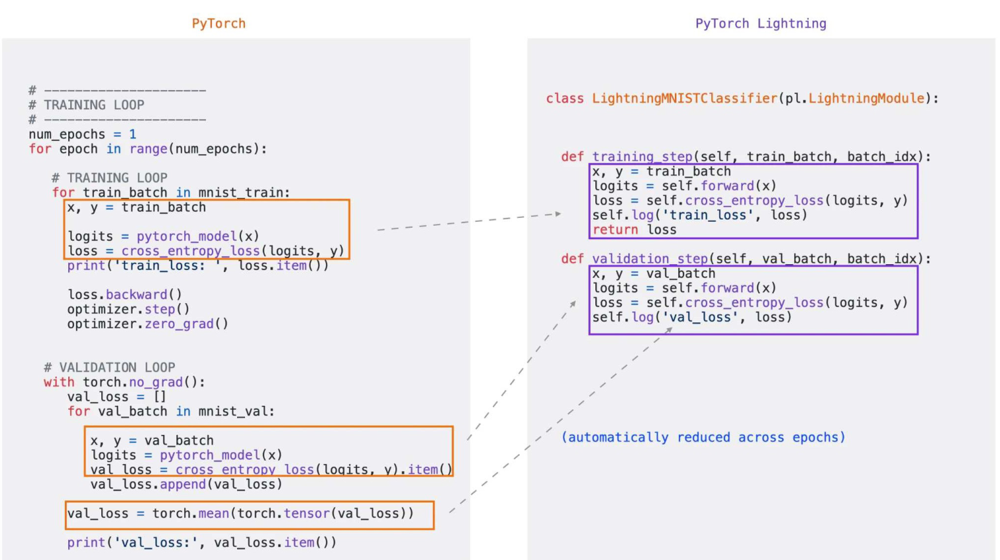

# From Pytorch to Pytorchlightning

+ model
```python
# torch
class Model(nn.Module):
    pass

# lightning
class Model(pl.LightningModule):
    pass
```

+ ckpt
```python
# torch
model = Model()
model.load_state_dict(torch.load(PATH))

# lightning
model = Model.load_from_checkpoint(PATH)
```

+ data
```python
# torch
transform = transform.Compose(...)
trainloader = DataLoader(...)
valloader = DataLoader(...)
Testloader = DataLoader(...)

# lightning (allows DataLoader as well)
class Data(pl.LightningDataModule)
    def prepare_data(self):  # no duplicate for GPUs Def 
        pass

    def train_dataloader(self):
        pass
    
    def val_dataloader(self):
        pass
    
    def test_dataloder(self):
        pass
```

+ optimizer
```python
# torch
optimizer = torch.optim.Adam(model.parameters, lr=1e-3)

# lightning
def configure_optimizer(self):
    return torch.optim.Adam(model.parameters, lr=1e-3)
```

+ loss
```python
# torch
lossFunc = nn.MSELoss()

# lightning
def lossFunc(self, logits, labels):
    return nn.MSELoss(logits, labels)
```

+ training and validation loop



# Example code
```python
trainer = pl.trainer()
trainer.fit(model, data)
```

+ More on pl.trainer:
    + instantiation:
        + accelerator: cpu, gpu, tpu, auto
        + strategy: ddp
        + devices: list[int]
        + num_nodes: 1
        + devices=1
        + accumulate_grad_batches=1
        + check_val_every_n_epochs=1
        + max_epochs=1000
        + max_steps=-1
        + deterministic=False
        + default_root_dir=os.getcwd()
        + callbacks=None
        + log_every_n_steps=50
    + fit:
        + model
        + train_dataloaders=None
        + val_dataloaders=None
        + datamodule=None
    + validate:
        + model
        + dataloaders=None
        + datamodule=None
    + predict
        + model=None
        + dataloaders=None
        + datamodule=None

+	Callbacks:
```python
from lightning.pytorch.callbacks import Callback


class PrintCallback(Callback):
    def on_train_start(self, trainer, pl_module):
        print("Training is started!")
    
    def on_train_end(self, trainer, pl_module):
        print("Training is done.")

trainer(callbacks=PrintCallBack)
```

+	More:
    + Customize backward pass
    + Customize optimizer updating
    + Tensorboard usage is same
