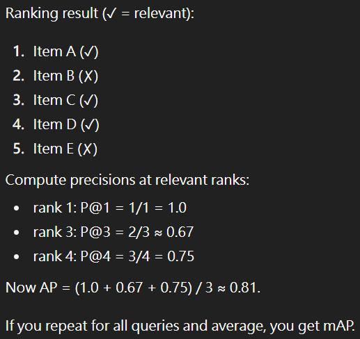
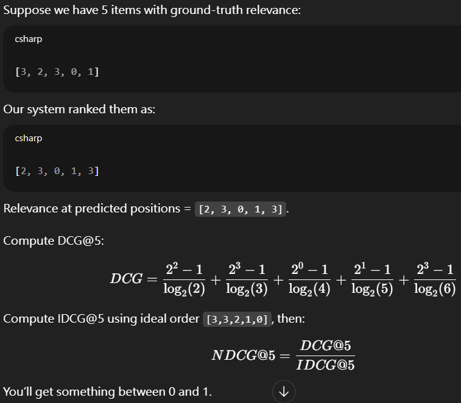

# ML

1. General Pipeline
    + Requirements specification
        + target
        + all functions
        + data source
        + compuatation resource w.r.t. scale
        + accuracy and efficiency
    + Identify ML tasks
        + Modality:
            + Tabular - time series or not
            + CV - Image, Video. (Classification, Detection, Segmentation)
            + NLP - Text, Audio. (LLM)
        + Category:
            + Supervised - classification, regression
            + Unsupervised - Clustering, Embedding, Generation
            + Reinforcement
    + Data Preparation
        + Observation, visualization
        + Missing filling, Normalization, Splitting
    + Model development
    + Evaluation
    + Deployment
        + Place: cloud or edge
        + Compression: distillation, pruning or quantization
        + Formal deployment strategies
            + Shadow: Raw model address request and feedback as usual. Request also send to new model (no feedback).
            + A/B test: 5% user use new model. 95% use raw model.
        + with accuracy supervisor

2. Image search
    + text data can be auxiliary method
    + build: Contrastive learning e.g. CLIP, simCLR
    + search: FAISS or QDrant. Local sensitive hash, hierachical clustering, quantization.
    + metric:
        + recall-k: hard to compute ground truth positive in huge database
        + precision-k: does not consider the order
        + mAP

Example

3. Google earth - privacy content blurring system
    + build: Object detection
        + Architecture
            + Two stage
            + One stage
            + DETR
        + Head
            + IOU
            + anchors: anchor-based, anchor-free
    + metrics
        + mAP
    + other enhancement: Self-suprvised, active learning

4. Youtube searching by text
    + Extract text information from videos
    + metrics
        + PR curve, ...
    + build: Text Embedding models
        + sparse: e.g. TFIDF
        + dense: NN

5. Harmful content detection
    + modality: text, image, video
    + a few labeling resource, user report can have a big plus
    + build - fusion across modalities, then
        + binary classification
        + multi-binary classification
    + feature extraction
        + post: likes, hates, text, repost, report, time
        + account: viloations, numbers of being reported, followers, meta personal data
    + metrics
        + PR curve, ...
    + service
        + lower the ranking

6. Video recommendation system
    + peronsal data
        + nearly complete watched history list
        + like list
    + mix methods
        + the most related videos
        + the most related users
    + feature extraction
        + video: language, time, title, tags
        + users: age, sex, language, country, city
    + method
        + matrix factorization (baseline)
        + two-tower network: video feature + user feature -> similarity
            + two-tower has independent two encoders, siamese use common one.
    + online metrics
        + watched videos
        + time watching
        + likes
    + real problems
        + two stage (hiereachical cluster) to deal with large data
        + cold-start: new user choose interested area
        + balance exploitation and exploration

7. Activity recommendation system
    + Despite embedding search, an approach is LTR (Learning To Rank)
        + pointwise -> learn rank by regression
        + pairwise -> learn preference (might be stable but needs lots of pairs)
        + listwise -> learn rank by multiple regression
    + Metric
        + nDCG
    + Feature extraction
        + price
        + time
        + distance
        + number of attending people
        + user personal feature
    + online metric
        + maximize revenue 

8. Advertisement recommendation
    + Features
        + tags of advertisement
        + use peronal feature
        + whether click the advertisement
        + staying time of the advertisement

9. Booking rooms recommendation
    + Session type recommendation
        + use recently browsing feature instead of long-term user feature

10. Posts recommendation
    + Metrics
        + user staying time on a post
        + likes, reply, repost, share, save
    + Supervised method
        + output prob of like, reply, repost, share, save

11. Friend recommendation. People you may know (PYMK) 
    + Feature
        + education
        + time and place
        + worked company
        + skills
    + methods
        + embedding
        + BFS with mutual friends
        + NN / GNN

# System
1. Scale
    + server
        + User url -> DNS server (ISP) -> get IP
        + request IP -> load balancer -> server
        + server -> website
    + load balancer
    + database replication
        + master-slave
            + 1 master, write-only
            + N slaves, read-only
            + synchronize by difference
    + cache, CDN (content deliver network)
    + database scaling
        + vertical
        + horizontal

2. Constants
    + time
        + cache: 1 ns
        + memory: 100 ns
        + disk: 10 ms
        + packet send around earth: 200 ms

3. Interview pipeline
    + requirement questioning
    + high-level design approval
    + detail design
    + summary

4. Rate limiter
    + server deal each IP with:
        + token bucket: each bucket has N balls, request once minus 1, add 1 per T time
        + leaking bucket: queue-behavior
        + sliding window with time

5. Consistent hash
    + motivation
        + load balancer
        + server add/remove do not affect most of the key-value pair
    + steps
        + a hash ring e.g. 0 ~ 2**31 - 1
        + hash each server: e.g. hash(s1)=0, hash(s2)=100, ...
        + hash data -> find next closest server
        + When server add/remove -> find closest
        + virtual hash to decrease imbalance
            + e.g. s1_0, s2_0, ..., sn_0, s1_1, ...

6. other real problems
    + data replication
        + e.g. s_i = closest(hash(x)), triplet backup
        + store s_i, s_i+1%N, s_i+2%N
    + synchronous of replication
        + quorum consensus
            + writable num >= threshold W
            + readable num >= threshold R
            + W + R >= N means has strong consistency
        + use version control to synchronize
    + malfunction
        + broadcast: gossip protocol
            + when s_i found s_x is malfunctioned, s_i tell s_j, then s_j tell s_k
            + i, j, k are random
        + address temporary malfunction
            + enhance threshold W and R
            + sloppy quorum: R/W top K server only
        + address permanant malfunction -> confirm synchronous accuracy
            + anti-entropy protocol: sync key instead of overall data
            + hash tree (Merkle tree):
                + use "hash_parent = hash(seg1) + hash(seg2)" to build up a tree
                + compare two tree difference (recursively from root to leaf)

7. Distributed unique ID
    + multi-master replication: each ID = <master_ID>-<increment_ID>
    + UUID without any synchronization, since collision is small
        + (26 (chars) + 10 (digits)) ^ 12 = 36 ^ 12
    + Twitter snowflake method: each ID =
        + 0 | time (41 bits) | data_center (5 bits) | machine (5 bits) | increment_id (12 bits)

8. short url
    + common hash function
        + CRC32
        + MD5
        + SHA
    + to enhance the compactness
        + change to base62 (62=26 (chars) * 2 (Capital & Lower) + 10 (digits))

9. Web crawler
    + Steps
        + start - seed url
        + recursive search
            + url extractor
            + BFS with queue to search all url
            + url filter
            + url seen
        + html downloader
            + multi-processing vs under rate limit
            + can use priority queue to rank
                + helpfulness
                + freshness
        + content
            + content parser
            + content seen
                + hash checksum
            + content storage
                + distributed data
                + cache by DNS
            + content filter
                + infinite looped url (spider trap)
                + harmful or meaning less content

10. App remote notification system
    + scenario
        + ios: app company -> APNs -> ios device
            + APNS: Apple push notification service
        + android: app company -> FCM -> android device
            + FCM: Firebase cloud messaging
        + text message: provider -> SMS -> device
        + email: provider -> email server -> device
    + why not send end2end directly
        + safe concern: quality and frequency constraint
        + prevent revealing IP address
    + other problems
        + prevent missing packet
        + use notification id to prevent duplication

11. Facebook (news feed, recommendation system of posts)
    + functions
        + post
        + get
    + post
        + load balancer -> webserver -> fanout to cache
            + fanout means notification to friends
    + get
        + load balancer -> webserver -> get friends posts from cache 

12. chatting room system
    + functions
        + both 1-to-1 and multiple people
        + send text message only
        + need to save all history message for searching
    + scenario
        + sender -> message storage -> reciever
    + methods
        + polling (inefficient)
        + web sockets (recommended)
    + storage
        + mysql - personal data
        + nosql - message
    + more problems
        + synchronous of different devices (or users)
        + is online: heart beat mechanism
            + tell server is online per 10 second
            + if server does not receive online -> status turns to offline

13. autocomplete text when searching
    + requirement
        + top 5
        + fast response
    + method
        + trie with limited depth
        + search max visited frequency
        + do not need to update trie frequently. can update daily

14. Youtube
    + requirements
        + large storage
        + upload
        + on-demand streaming
        + live streaming
    + large storage
        + space estimation
        + BLOB: binary large object storage?
        + distributed storage
            + cut and replicate each segment and store in different nodes
        + use with CDN
    + upload -> transcoding -> load balancer -> storage
        + transcoding: change to different resolution by varied compression algorithms
    + other problem
        + multi-processing
        + check sum for complete check

15. Google drive
    + space estimation
    + functions
        + upload
        + download
        + fix
        + sync by delta
