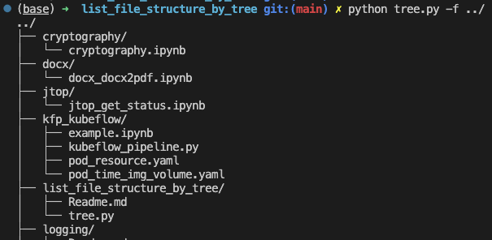

# Introduction
A tool for visualization of file structure.
[Reference](https://newbedev.com/list-directory-tree-structure-in-python).

# Usage
```bash
python tree.py -f path/to/folder
```

# Example

